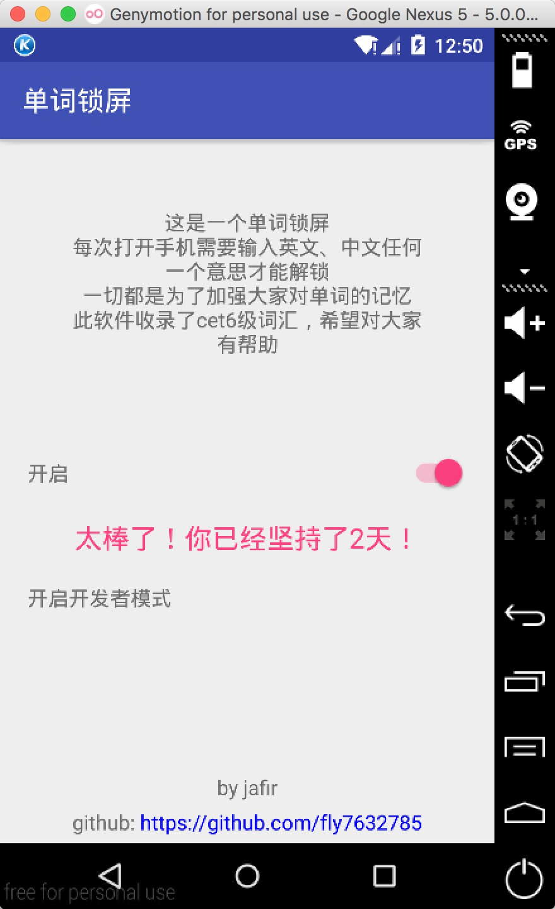
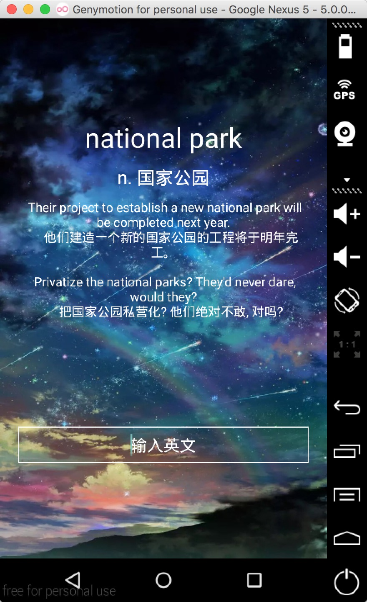
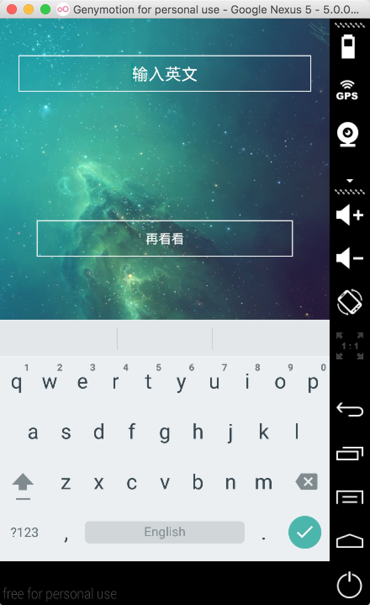
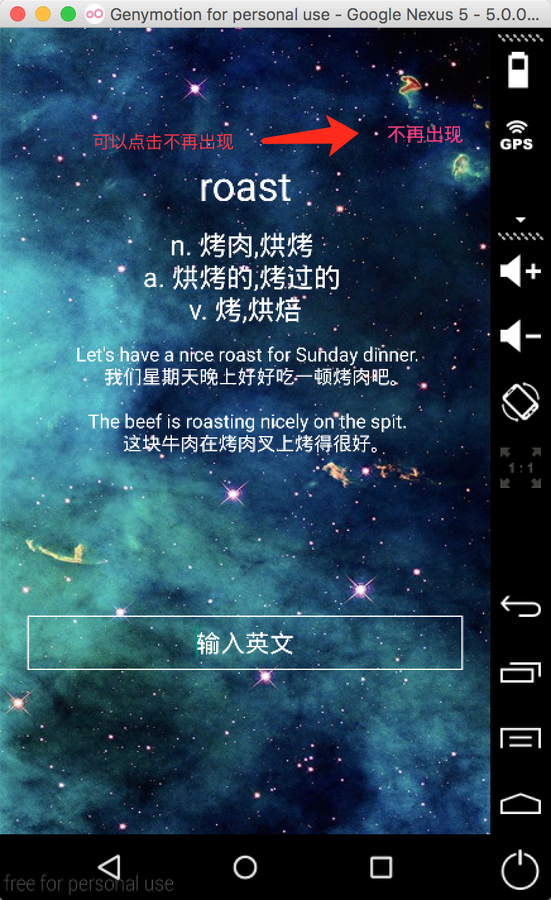

# 单词锁屏

>这款单词锁屏是专门为没有自觉性记单词的人设计的，带有强制性，非诚勿用 
>里面收录了cet6级词汇，所以数据库文件有点大，没有联网（没有找到好的开源接口） 
>功能：每次打开锁屏之后，需要输入英文，然后输入中文的任何一个意思才能进入 
>对记单词很有帮助，俗话说好记性不如敲一遍。

简书地址：http://www.jianshu.com/p/0bc3d3a65243
 
APK:http://jafir-my-love.oss-cn-shanghai.aliyuncs.com/lockscreen.apk

 
### 截图

